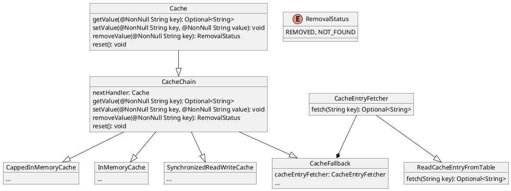

# About this project

This project implements a cache with a fallback to database in a case when key is not present.
Main classes are Cache and Cache chain, which implement chain if responsibility and strategy pattern.

There are four implementations of CacheChain:
1. InMemoryCache
    2. Base implementation of cache which stores data in a HashMap
1. CappedInMemoryCache
   2. Stores only limited count of keys. In this implementation it's 2. When cache grows over the limit the oldest element is removed.
1. SynchronizedReadWriteCache
    2. Intended to server as a wrapper for other CacheChain implementations providing full sychnronization of read/set/remove/reset operation. Doesn't provide any chaching utilty by itself
1. CacheFallback
    2. Serves as a fallback for all other CacheChain implementations
       3. Uses CacheEntryFetcher as a way to abstract DB call - this approach makes it easier to mock DB calls during testing

# Testing
There are two main ways to present/test this project functionalities:
1. REST endpoint exposed by `CacheResource` component, detailed API documentation can be found in `api.yml` file
2. Calling one of implementation of `BaseCacheApplicationTest`

This project for simplicity uses H2 database.